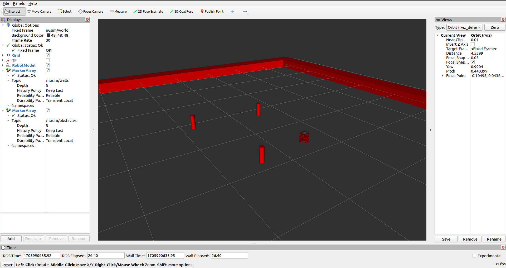

# NUSIM Package
A package for simuating the turtlebot in an rviz scene.

# Launchfile
Use `ros2 launch nusim nusim.launch.xml` to launch the simulation scene.
The simulation contains the turtlebot, some obstacles and the arena walls.

# Parameter Description
- rate: The frequency of simulation frame update in Hz.
- x0: The initial x position of the turtlebot.
- y0: The initial y position of the turtlebot.
- theta0: The initial orientation of the turtlebot.
- arena_x_length: The length of the arena.
- arena_y_length: The width of the arena.
- obstacles:
    - x: The x coordinates of the obstacles in the scene in the form of a list.
    - y: The y coordinates of the obstacles in the scene in the form of a list.
    - r: The radius of the cylindrical obstacles.

# Rviz Simulation

