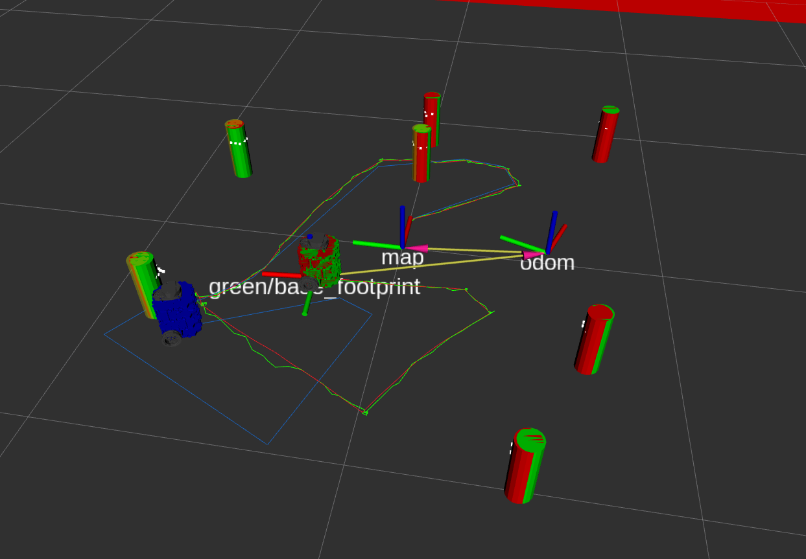

# NUSLAM Library
A library for implementing EKF SLAM on the Turtlebot.

# Launchfile
Use `ros2 launch nuslam slam.launch.xml cmd_src:=teleop robot:=nusim use_rviz:=true`
to launch the required nodes to control the turtlebot (using Fake Sensor Data).

Use `ros2 launch nuslam unknown_data_assoc.launch.xml cmd_src:=teleop robot:=nusim use_rviz:=true`
to launch the required nodes to control the turtlebot (using Unknown Data Association).

Use `ros2 launch nuslam landmark_detect.launch.xml cmd_src:=teleop robot:=nusim use_rviz:=true`
to launch landmark detection test simulation.

## Demo Video (Simulation)
https://private-user-images.githubusercontent.com/72541517/312706714-25da5848-e1b6-4554-9eb9-b78f0942ac20.webm?jwt=eyJhbGciOiJIUzI1NiIsInR5cCI6IkpXVCJ9.eyJpc3MiOiJnaXRodWIuY29tIiwiYXVkIjoicmF3LmdpdGh1YnVzZXJjb250ZW50LmNvbSIsImtleSI6ImtleTUiLCJleHAiOjE3MTAzOTMxNjksIm5iZiI6MTcxMDM5Mjg2OSwicGF0aCI6Ii83MjU0MTUxNy8zMTI3MDY3MTQtMjVkYTU4NDgtZTFiNi00NTU0LTllYjktYjc4ZjA5NDJhYzIwLndlYm0_WC1BbXotQWxnb3JpdGhtPUFXUzQtSE1BQy1TSEEyNTYmWC1BbXotQ3JlZGVudGlhbD1BS0lBVkNPRFlMU0E1M1BRSzRaQSUyRjIwMjQwMzE0JTJGdXMtZWFzdC0xJTJGczMlMkZhd3M0X3JlcXVlc3QmWC1BbXotRGF0ZT0yMDI0MDMxNFQwNTA3NDlaJlgtQW16LUV4cGlyZXM9MzAwJlgtQW16LVNpZ25hdHVyZT05NTU4ZGRlZWM1MWE2ZWEyM2RkNjdiYWNjNGVlN2EwZDZhYjgyNWYwZDkwMTdkYTUxYjMzMzEwOTE1ZjgyZmZkJlgtQW16LVNpZ25lZEhlYWRlcnM9aG9zdCZhY3Rvcl9pZD0wJmtleV9pZD0wJnJlcG9faWQ9MCJ9.Bvp-EbtEdhk1Px7aOZqCecJid2rSvTNs0UTO4gwbP8Q

### Results (For EKF SLAM with Landmark Detection and Unknown Data Association)
##### Ground Truth
```
x: 0.0 m
y: 0.0 m
θ: 0.0 rad
```

##### Odometry Estimate (Blue)
```
x:  0.0147 m
y:  -0.9105 m
θ: 0.0491 rad

Positional error: 0.910 m
Rotational error: 0.049 rad

```

##### EKF SLAM Estimate (Green)
```
x:  0.0122 m
y:  0.0073 m
θ:  0.0964 rad

Positional error: 0.014 m
Rotational error: 0.096 rad
```

## SLAM Example (Simulation with Fake Sensor Data)


