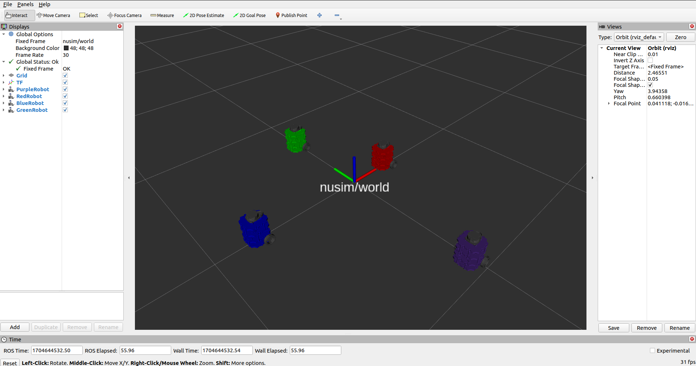

# Nuturtle  Description
URDF files for Nuturtle Gizmo.
* `ros2 launch nuturtle_description load_one.launch.py` to see the robot in rviz.
* `ros2 launch nuturtle_description load_all.launch.xml` to see four copies of the robot in rviz.

* The rqt_graph when all four robots are visualized (Nodes Only, Hide Debug) is:

# Launch File Details
* `ros2 launch nuturtle_description load_one.launch.py --show-args` to show arguments of load_one.launch.py

```
  Arguments (pass arguments as '<name>:=<value>'):

    'use_jsp':
        true (default): use jsp to publish joint states, otherwise no joint states published
        (default: 'true')

    'use_rviz':
        true (default): start rviz, otherwise don't start rviz
        (default: 'true')

    'color':
        purple (default): set the color of the robot. Valid choices are: ['red', 'green', 'blue', 'purple']
        (default: 'purple')
        
```

* `ros2 launch nuturtle_description load_all.launch.xml --show-args` to show arguments of load_all.launch.xml

  ```
  Arguments (pass arguments as '<name>:=<value>'):

    'use_jsp':
        true (default): use jsp to publish joint states, otherwise no joint states published
        (default: 'true')

    'use_rviz':
        true (default): start rviz, otherwise don't start rviz
        (default: 'true')

    'color':
        purple (default): set the color of the robot. Valid choices are: ['red', 'green', 'blue', 'purple']
        (default: 'purple')
```

